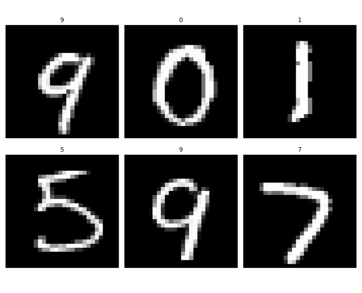

## 第一次汇报

1. [吴恩达](https://www.bilibili.com/video/BV1Bq421A74G/)网课进度（80/142）
2. 复现简单的CNN网络架构[（LeNet）](https://img-blog.csdnimg.cn/01692662e519428ca6745dd58b471ff5.jpg)，改用Softmax激活函数，对MNIST进行分类，正确率98.84%

```python
# HandWritingDetect.py
import gzip
import os
from matplotlib import pyplot as plt
import numpy as np
import torch
from torch import nn
from torch.utils.data import Dataset, DataLoader
from torchvision import transforms
from tqdm import tqdm

os.environ['KMP_DUPLICATE_LIB_OK']='True'

__all__ = ['parse_mnist', 'HW_Dataset', 'HW_Network']

# 解析函数来自CSDN
def parse_mnist(minst_file_addr: str = None) -> np.array:
    if minst_file_addr is not None:
        minst_file_name = os.path.basename(minst_file_addr)  # 根据地址获取MNIST文件名字
        with gzip.open(filename=minst_file_addr, mode="rb") as minst_file:
            mnist_file_content = minst_file.read()
        if "label" in minst_file_name:  # 传入的为标签二进制编码文件地址
            data = np.frombuffer(buffer=mnist_file_content, dtype=np.uint8, offset=8)  # MNIST标签文件的前8个字节为描述性内容，直接从第九个字节开始读取标签，并解析
        else:  # 传入的为图片二进制编码文件地址
            data = np.frombuffer(buffer=mnist_file_content, dtype=np.uint8, offset=16)  # MNIST图片文件的前16个字节为描述性内容，直接从第九个字节开始读取标签，并解析
            data = data.reshape(-1, 28, 28)
    else:
        raise ValueError("请传入MNIST文件地址!")

    return data


train_imgs = parse_mnist(r'mnist\MNIST\raw\train-images-idx3-ubyte.gz')
train_labels = parse_mnist(r'mnist\MNIST\raw\train-labels-idx1-ubyte.gz')

class HW_Dataset(Dataset):
    def __init__(self,imgs,labels,transform) -> None:
        super().__init__()
        self.transform = transform
        self.imgs = imgs
        self.labels = labels
    def __len__(self):
        return len(self.labels)
    def __getitem__(self, index):
        img = self.imgs[index]
        label = self.labels[index]
        if self.transform is not None:
            img = self.transform(img)
        return img, label

class HW_Network(nn.Module):
    '''
    input: (batch_num, channels=1, w=28, h=28)
    output: (batch_num, 10)
    '''
    def __init__(self) -> None:
        super().__init__()
        self.layer = nn.Sequential(
            # 1*28*28 to 6*28*28
            nn.Conv2d(1,6,kernel_size=3,padding=1,stride=1),
            nn.Softmax(dim=1),
            # nn.Sigmoid(),
            # 6*28*28 to 6*14*14
            nn.AvgPool2d(kernel_size=2,stride=2),
            # 6*14*14 to 16*10*10
            nn.Conv2d(6,16,kernel_size=5,stride=1),
            nn.Softmax(dim=1),
            # nn.Sigmoid(),
            # 16*10*10 to 16*5*5
            nn.AvgPool2d(kernel_size=2,stride=2),
            # 16*5*5 to 120*1*1
            nn.Conv2d(16,120,kernel_size=5,stride=1),
            # nn.Sigmoid(),
            nn.Softmax(dim=1),
            nn.Flatten(),
            nn.Linear(120,84),
            nn.Linear(84,10)
        )
    def forward(self, x: torch.Tensor):
        '''
        Args:
            x (Tensor): size is (batch, c, h, w) 
        '''
        x = self.layer(x)
        return x

# 查看每一层：
# rand = torch.rand(size=(1,1,28,28))
# for layer in HW_Network().layer:
#     rand = layer(rand)
#     print(rand.shape)

dataset = HW_Dataset(
    imgs=train_imgs,
    labels=train_labels,
    transform=transforms.Compose([
        transforms.ToTensor()
        # 这里img必须转换成tensor
    ])
)

model = HW_Network().to('cuda')
train_loader = DataLoader(dataset,batch_size=16,shuffle=True,num_workers=4)
optimizer = torch.optim.Adam(model.parameters(),lr=0.001)
criterion = nn.CrossEntropyLoss()

if __name__ == '__main__':
    epoch = 100
    for i in range(epoch):
        bar = tqdm(total=60000,desc='进度',ncols=80)
        bar.set_description(f"epoch {i+1}/{epoch}")
        for idx, (img, label) in enumerate(train_loader):
            img, label = img.cuda(), label.cuda()
            out = model(img)
            loss = criterion(out,label)
            loss.backward()
            optimizer.step()
            optimizer.zero_grad()
            bar.set_postfix(loss=f"{loss.item():.6f}")
            bar.update(16)
        bar.close()
    torch.save(model.state_dict(),"mnist.pth")
```

```python
# TestHWModel.py
from HandWritingDetect import HW_Dataset, parse_mnist, HW_Network
import torch
from torchvision import transforms
from torch.utils.data import DataLoader, Dataset
from matplotlib import pyplot as plt

test_imgs = parse_mnist(r'mnist\MNIST\raw\t10k-images-idx3-ubyte.gz')
test_labels = parse_mnist(r'mnist\MNIST\raw\t10k-labels-idx1-ubyte.gz')

dataset = HW_Dataset(
    imgs=test_imgs,
    labels=test_labels,
    transform=transforms.Compose([
        transforms.ToTensor()
        # 这里img必须转换成tensor
    ])
    )
test_loader = DataLoader(dataset,batch_size=1,shuffle=False,num_workers=4,pin_memory=True)
model = HW_Network()
model.load_state_dict(torch.load('mnist.pth'))
model.eval()
if __name__ == '__main__':
    with torch.no_grad():
        correct_nums = 0
        for idx, (img, label) in enumerate(test_loader):
            output: torch.Tensor = model(img)
            output = output.argmax(dim=1)
            if output == label:
                correct_nums += 1
        print(f'正确率：{correct_nums/len(test_loader):.2%}')

```

- 终端打印记录：

```shell
PS E:\Math\CNN> & D:/anaconda3/envs/torch121/python.exe e:/Math/CNN/TestHWModel.py
正确率：98.84%
```

- 图

